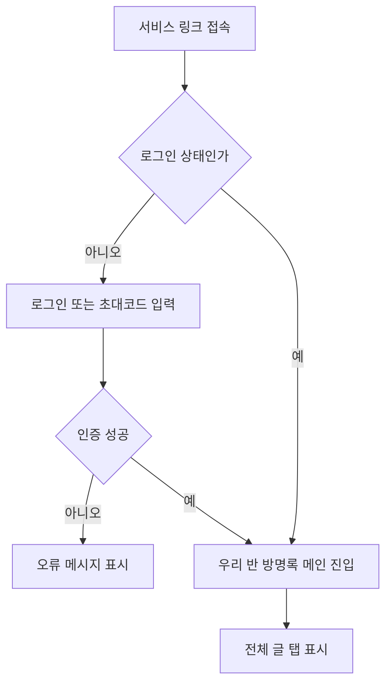
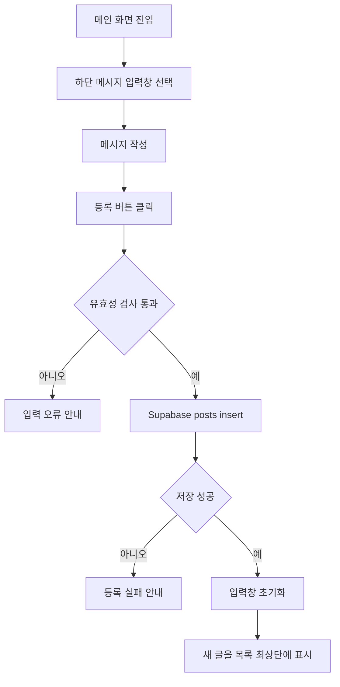
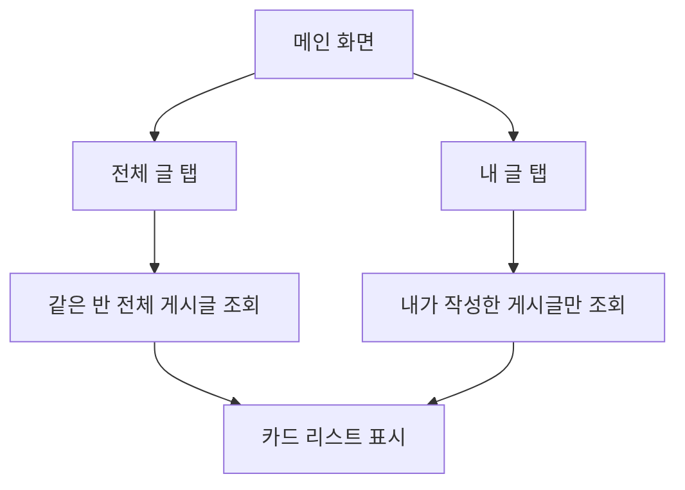
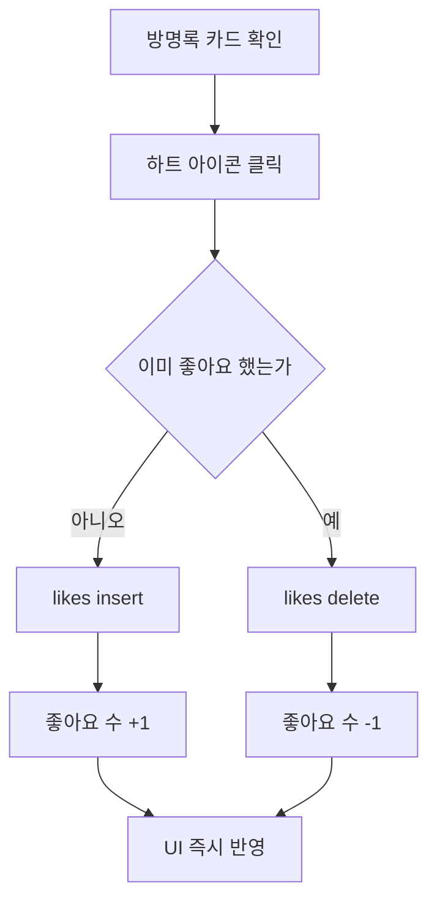
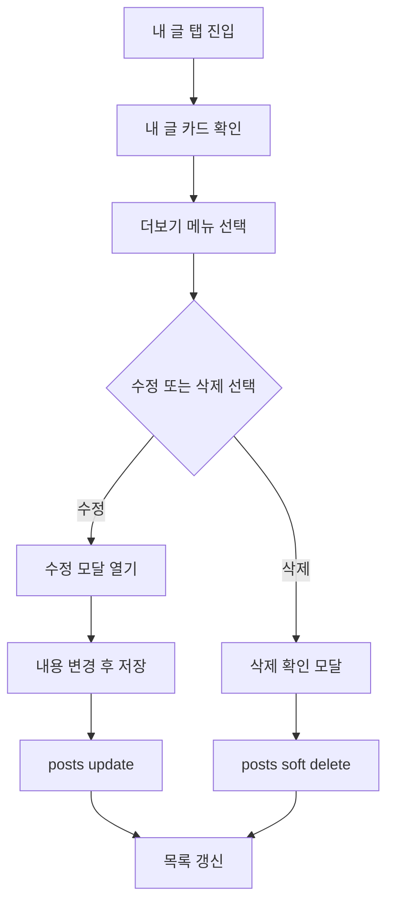
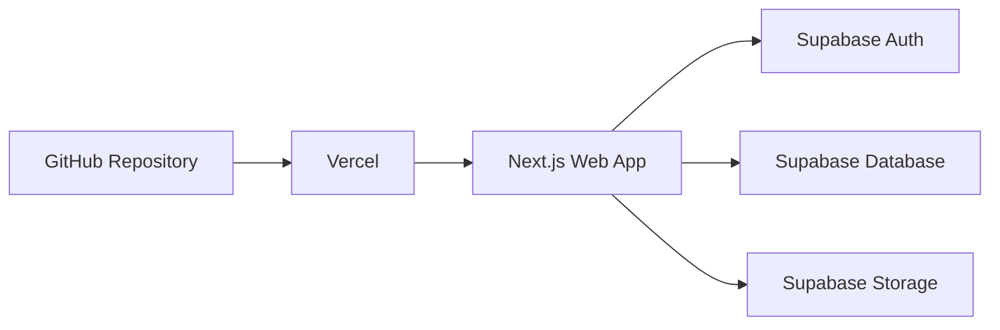

# 개발자용 PRD  
# 학과 방명록 서비스

## 0 문서 정보

| 항목 | 내용 |
|---|---|
| 문서명 | 학과 방명록 PRD |
| 대상 사용자 | 대학생 |
| 서비스 형태 | 학과 또는 반 단위 모바일 중심 방명록 웹 서비스 |
| 작성 기준 | 사용자가 제공한 아이디어와 업로드된 참고 인터페이스 이미지 기반 |
| 산출물 형식 | Markdown |
| 기술 스택 | Next.js, GitHub, Supabase, Vercel |

---

## 1 서비스 개요

학과 방명록 서비스는 같은 학과 또는 같은 반에 속한 대학생들이 짧은 메시지를 남기고 서로의 글에 공감할 수 있는 모바일 중심 웹 서비스입니다

참고 이미지의 핵심 인터페이스는 다음과 같이 반영합니다

| UI 요소 | PRD 반영 내용 |
|---|---|
| 상단 제목 | `우리 반 방명록` 형태의 학과 또는 반 단위 타이틀 |
| 좌측 메뉴 아이콘 | 학과 선택, 내 정보, 로그아웃 등 사이드 메뉴 진입 |
| 우측 알림 아이콘 | 내 글 좋아요, 새 글, 공지 알림 진입 |
| 탭 메뉴 | `전체 글`, `내 글` 필터 제공 |
| 방명록 카드 | 프로필 이미지, 이름, 작성일, 메시지, 좋아요 수 표시 |
| 하단 입력 영역 | 메시지 입력 후 `등록` 버튼으로 즉시 작성 |
| 모바일 화면 | 한 손 사용을 고려한 세로형 카드 피드 구조 |

---

## 2 목표와 비목표

### 2-1 목표

| 구분 | 내용 |
|---|---|
| 핵심 목표 | 학과 구성원이 부담 없이 짧은 메시지를 남기는 온라인 방명록 제공 |
| 사용자 목표 | 같은 반 또는 학과 친구들의 메시지를 빠르게 확인하고 반응하기 |
| 운영 목표 | 별도 앱 설치 없이 웹 링크만으로 접근 가능한 MVP 구현 |
| 개발 목표 | Next.js와 Supabase 기반으로 빠르게 개발 가능한 구조 설계 |

### 2-2 비목표

| 구분 | 제외 범위 |
|---|---|
| 실시간 채팅 | 1:1 채팅이나 단체 채팅은 MVP 범위에서 제외 |
| 복잡한 SNS 기능 | 팔로우, 댓글 스레드, DM은 MVP 범위에서 제외 |
| 다중 학교 확장 | 최초 버전은 단일 학교 또는 단일 학과 운영을 기준으로 설계 |
| 관리자 통계 대시보드 | MVP 이후 확장 기능으로 분리 |

---

## 3 5W1H 표

| 구분 | 내용 | 개발 반영 포인트 |
|---|---|---|
| Who | 대학생, 특히 같은 학과 또는 같은 반 학생 | 학과 또는 반 단위 접근 권한 필요 |
| What | 짧은 방명록 글 작성, 조회, 좋아요, 내 글 확인 | 게시글 CRUD와 좋아요 기능 필요 |
| When | 수업 후, 프로젝트 시작과 종료 시점, 학과 행사 전후 | 모바일에서 빠른 작성 가능해야 함 |
| Where | 학교 안팎, 강의실, 과방, 학과 행사장 | 반응형 웹과 모바일 우선 UI 필요 |
| Why | 학과 구성원 간 소속감 형성, 응원 메시지 공유, 프로젝트 기록 보관 | 긍정적이고 가벼운 커뮤니티 경험 설계 |
| How | 웹 링크 접속 후 로그인 또는 초대코드 인증을 거쳐 방명록 작성 | Supabase Auth 또는 초대코드 기반 인증 필요 |

---

## 4 사용자 유형

| 사용자 유형 | 설명 | 주요 권한 |
|---|---|---|
| 비로그인 사용자 | 서비스 링크에 접근했지만 인증하지 않은 사용자 | 로그인 화면만 접근 |
| 일반 학생 | 학과 또는 반에 소속된 사용자 | 글 작성, 전체 글 조회, 내 글 조회, 좋아요 |
| 글 작성자 | 본인이 작성한 글을 가진 사용자 | 본인 글 수정, 삭제 |
| 관리자 | 학과 대표, 조교, 운영자 역할 | 부적절한 글 숨김, 사용자 관리, 공지 관리 |

---

## 5 핵심 기능 상세 정의

### 5-1 회원 인증

| 항목 | 내용 |
|---|---|
| 기능명 | 회원 인증 |
| 목적 | 학과 구성원만 방명록에 접근하도록 제한 |
| MVP 방식 | 이메일 로그인 또는 초대코드 기반 입장 |
| 권장 방식 | Supabase Auth 이메일 OTP 로그인 |
| 필수 입력값 | 이메일 또는 초대코드 |
| 예외 처리 | 인증 실패 시 오류 메시지 표시 |
| 성공 결과 | 사용자의 `student_id`, `department_id`, `class_id`를 기준으로 방명록 접근 |

### 5-2 전체 글 조회

| 항목 | 내용 |
|---|---|
| 기능명 | 전체 글 조회 |
| 목적 | 같은 학과 또는 같은 반 사용자의 방명록 글 확인 |
| 화면 위치 | 메인 화면 `전체 글` 탭 |
| 정렬 기준 | 최신 작성순 |
| 표시 정보 | 프로필 이미지, 이름, 작성일, 메시지, 좋아요 수 |
| 빈 상태 | 아직 등록된 방명록이 없어요 |
| 로딩 상태 | 카드 스켈레톤 UI 표시 |
| 실패 상태 | 글을 불러오지 못했어요, 다시 시도해주세요 |

### 5-3 내 글 조회

| 항목 | 내용 |
|---|---|
| 기능명 | 내 글 조회 |
| 목적 | 사용자가 자신이 작성한 글만 따로 확인 |
| 화면 위치 | 메인 화면 `내 글` 탭 |
| 필터 조건 | `posts.user_id = auth.user.id` |
| 표시 정보 | 전체 글 카드와 동일 |
| 빈 상태 | 아직 작성한 글이 없어요 |
| 후속 액션 | 글 작성 입력창으로 유도 |

### 5-4 글 작성

| 항목 | 내용 |
|---|---|
| 기능명 | 방명록 글 작성 |
| 목적 | 학생이 짧은 메시지를 남길 수 있게 함 |
| 화면 위치 | 하단 고정 입력 영역 |
| 입력 필드 | 메시지 |
| 버튼 | 등록 |
| 글자 수 제한 | 1자 이상 120자 이하 |
| 금지 조건 | 빈 값, 공백만 있는 값, 120자 초과 |
| 성공 동작 | 입력창 초기화 후 전체 글 목록 최상단에 새 카드 추가 |
| 실패 동작 | 등록 실패 메시지 표시 |
| UX 기준 | 모바일 키보드가 올라와도 등록 버튼이 보이도록 처리 |

### 5-5 글 수정

| 항목 | 내용 |
|---|---|
| 기능명 | 방명록 글 수정 |
| 목적 | 작성자가 본인 글을 수정할 수 있게 함 |
| 접근 방식 | 내 글 카드의 더보기 메뉴 |
| 권한 조건 | 작성자 본인만 가능 |
| 수정 가능 항목 | 메시지 내용 |
| 성공 동작 | 카드 내용 즉시 갱신 |
| 실패 동작 | 수정 실패 메시지 표시 |

### 5-6 글 삭제

| 항목 | 내용 |
|---|---|
| 기능명 | 방명록 글 삭제 |
| 목적 | 작성자가 본인 글을 삭제할 수 있게 함 |
| 접근 방식 | 내 글 카드의 더보기 메뉴 |
| 권한 조건 | 작성자 본인 또는 관리자 |
| 삭제 방식 | MVP에서는 soft delete 권장 |
| 성공 동작 | 목록에서 해당 카드 제거 |
| 실패 동작 | 삭제 실패 메시지 표시 |

### 5-7 좋아요

| 항목 | 내용 |
|---|---|
| 기능명 | 좋아요 |
| 목적 | 짧은 공감 반응 제공 |
| 화면 위치 | 각 방명록 카드 우측 하단 |
| 아이콘 | 하트 |
| 정책 | 사용자 1명당 게시글 1개에 좋아요 1회 |
| 재클릭 동작 | 좋아요 취소 |
| 표시 정보 | 좋아요 총 개수 |
| 데이터 조건 | `likes` 테이블에서 `user_id + post_id` unique 처리 |
| 실패 동작 | 좋아요 반영 실패 메시지 표시 |

### 5-8 알림

| 항목 | 내용 |
|---|---|
| 기능명 | 알림 |
| 목적 | 내 글에 좋아요가 눌렸거나 새 공지가 있을 때 확인 |
| 화면 위치 | 우측 상단 종 아이콘 |
| MVP 범위 | 알림 목록 화면 제공 |
| 알림 유형 | 내 글 좋아요, 관리자 공지 |
| 읽음 처리 | 알림 클릭 시 읽음 처리 |
| 확장 가능성 | 푸시 알림은 MVP 이후 검토 |

### 5-9 사이드 메뉴

| 항목 | 내용 |
|---|---|
| 기능명 | 사이드 메뉴 |
| 목적 | 기본 서비스 메뉴 접근 |
| 화면 위치 | 좌측 상단 햄버거 아이콘 |
| 메뉴 항목 | 내 프로필, 학과 정보, 알림, 로그아웃 |
| 관리자 전용 | 사용자 관리, 신고 글 관리 |
| UX 기준 | 모바일에서 좌측 슬라이드 패널로 표시 |

### 5-10 관리자 신고 및 숨김

| 항목 | 내용 |
|---|---|
| 기능명 | 글 신고 및 숨김 |
| 목적 | 부적절한 글 관리 |
| MVP 방식 | 관리자만 수동 숨김 가능 |
| 확장 방식 | 일반 사용자 신고 기능 추가 가능 |
| 숨김 처리 | `posts.is_hidden = true` |
| 사용자 화면 | 숨김 글은 일반 목록에서 제외 |

---

## 6 UX Flow

### 6-1 첫 진입 Flow



### 6-2 글 작성 Flow



### 6-3 탭 전환 Flow



### 6-4 좋아요 Flow



### 6-5 내 글 수정 삭제 Flow



---

## 7 화면 설계

### 7-1 메인 화면

| 영역 | 구성 요소 | 설명 |
|---|---|---|
| Status 영역 | 시간, 네트워크, 배터리 | 모바일 브라우저 환경에서는 시스템 영역으로 처리 |
| Header | 메뉴 아이콘, 페이지 제목, 알림 아이콘 | 제목은 `우리 반 방명록`으로 표시 |
| Tab | 전체 글, 내 글 | 선택된 탭은 연한 베이지 배경으로 강조 |
| List | 방명록 카드 리스트 | 세로 스크롤 |
| Input Bar | 메시지 입력창, 등록 버튼 | 화면 하단 고정 |

### 7-2 방명록 카드 UI

| 요소 | 설명 |
|---|---|
| 프로필 이미지 | 원형 아바타 |
| 이름 | 작성자 이름 |
| 작성일 | `YYYY.MM.DD` 형식 |
| 메시지 | 최대 2줄 우선 표시 |
| 좋아요 | 하트 아이콘과 숫자 |
| 카드 스타일 | 흰색 배경, 둥근 모서리, 약한 그림자 |

### 7-3 입력 영역 UI

| 요소 | 설명 |
|---|---|
| Placeholder | 메시지를 입력하세요 |
| 등록 버튼 | 검은색 배경, 흰색 텍스트 |
| 비활성 상태 | 입력값이 없으면 버튼 비활성화 |
| 활성 상태 | 1자 이상 입력 시 버튼 활성화 |
| 오류 상태 | 글자 수 초과 또는 저장 실패 안내 |

---

## 8 정보 구조

```text
/
├─ login
├─ guestbook
│  ├─ 전체 글
│  └─ 내 글
├─ notifications
├─ profile
└─ admin
   ├─ posts
   └─ users
```

---

## 9 데이터 모델

### 9-1 profiles

| 필드명 | 타입 | 설명 |
|---|---|---|
| id | uuid | Supabase Auth user id |
| name | text | 사용자 이름 |
| avatar_url | text | 프로필 이미지 URL |
| department_id | uuid | 소속 학과 id |
| class_id | uuid | 소속 반 id |
| role | text | student 또는 admin |
| created_at | timestamp | 생성일 |

### 9-2 departments

| 필드명 | 타입 | 설명 |
|---|---|---|
| id | uuid | 학과 id |
| name | text | 학과명 |
| university_name | text | 학교명 |
| created_at | timestamp | 생성일 |

### 9-3 classes

| 필드명 | 타입 | 설명 |
|---|---|---|
| id | uuid | 반 id |
| department_id | uuid | 학과 id |
| name | text | 반 이름 |
| invite_code | text | 초대코드 |
| created_at | timestamp | 생성일 |

### 9-4 posts

| 필드명 | 타입 | 설명 |
|---|---|---|
| id | uuid | 게시글 id |
| user_id | uuid | 작성자 id |
| department_id | uuid | 학과 id |
| class_id | uuid | 반 id |
| content | text | 방명록 내용 |
| is_hidden | boolean | 관리자 숨김 여부 |
| is_deleted | boolean | 삭제 여부 |
| created_at | timestamp | 작성일 |
| updated_at | timestamp | 수정일 |

### 9-5 likes

| 필드명 | 타입 | 설명 |
|---|---|---|
| id | uuid | 좋아요 id |
| post_id | uuid | 게시글 id |
| user_id | uuid | 좋아요 누른 사용자 id |
| created_at | timestamp | 생성일 |

제약 조건

```sql
unique(post_id, user_id)
```

### 9-6 notifications

| 필드명 | 타입 | 설명 |
|---|---|---|
| id | uuid | 알림 id |
| user_id | uuid | 알림 수신자 id |
| type | text | like 또는 notice |
| post_id | uuid | 관련 게시글 id |
| message | text | 알림 문구 |
| is_read | boolean | 읽음 여부 |
| created_at | timestamp | 생성일 |

---

## 10 Supabase RLS 정책 방향

| 테이블 | 정책 |
|---|---|
| profiles | 본인 프로필 조회와 수정 가능, 관리자는 전체 조회 가능 |
| posts | 같은 `class_id` 사용자만 조회 가능 |
| posts insert | 로그인 사용자만 작성 가능 |
| posts update | 작성자 본인 또는 관리자만 가능 |
| posts delete | 작성자 본인 또는 관리자만 soft delete 가능 |
| likes | 같은 `class_id` 게시글에만 좋아요 가능 |
| notifications | 본인 알림만 조회 가능 |

예시 정책 방향

```sql
-- 같은 반의 공개 게시글만 조회
class_id = (
  select class_id
  from profiles
  where id = auth.uid()
)
and is_hidden = false
and is_deleted = false
```

---

## 11 API 또는 Server Action 정의

Next.js App Router 기준으로 Server Actions 또는 Route Handlers 중 하나를 선택해 구현합니다

| 기능 | Method | Path 또는 Action | 설명 |
|---|---|---|---|
| 전체 글 조회 | GET | `/api/posts?scope=all` | 같은 반 전체 글 조회 |
| 내 글 조회 | GET | `/api/posts?scope=mine` | 내 글만 조회 |
| 글 작성 | POST | `/api/posts` | 방명록 글 작성 |
| 글 수정 | PATCH | `/api/posts/:id` | 본인 글 수정 |
| 글 삭제 | DELETE | `/api/posts/:id` | 본인 글 soft delete |
| 좋아요 추가 | POST | `/api/posts/:id/like` | 좋아요 등록 |
| 좋아요 취소 | DELETE | `/api/posts/:id/like` | 좋아요 취소 |
| 알림 조회 | GET | `/api/notifications` | 본인 알림 조회 |
| 알림 읽음 처리 | PATCH | `/api/notifications/:id/read` | 알림 읽음 처리 |

---

## 12 컴포넌트 구조

```text
src/
├─ app/
│  ├─ login/
│  ├─ guestbook/
│  ├─ notifications/
│  └─ admin/
├─ components/
│  ├─ layout/
│  │  ├─ MobileShell.tsx
│  │  ├─ Header.tsx
│  │  └─ BottomInputBar.tsx
│  ├─ guestbook/
│  │  ├─ GuestbookTabs.tsx
│  │  ├─ GuestbookCard.tsx
│  │  ├─ GuestbookList.tsx
│  │  └─ GuestbookForm.tsx
│  └─ common/
│     ├─ Avatar.tsx
│     ├─ Button.tsx
│     ├─ EmptyState.tsx
│     └─ LoadingSkeleton.tsx
├─ lib/
│  ├─ supabase/
│  ├─ validations/
│  └─ utils/
└─ types/
   └─ database.ts
```

---

## 13 기술 스택

| 영역 | 기술 | 사용 목적 |
|---|---|---|
| Frontend | Next.js | 화면 구현, 라우팅, 서버 렌더링 또는 서버 액션 처리 |
| Repository | GitHub | 코드 저장소, 이슈 관리, PR 리뷰 |
| Backend | Supabase | Auth, Database, Storage, Row Level Security |
| Deployment | Vercel | Next.js 배포, Preview URL, Production 운영 |
| Styling | Tailwind CSS 권장 | 모바일 중심 UI 빠른 구현 |
| Form Validation | Zod 권장 | 입력값 검증 |
| State | React state 또는 TanStack Query 선택 | 목록 갱신과 비동기 상태 관리 |

---

## 14 GitHub 운영 규칙

| 항목 | 규칙 |
|---|---|
| 기본 브랜치 | `main` |
| 개발 브랜치 | `dev` |
| 기능 브랜치 | `feature/기능명` |
| 버그 브랜치 | `fix/버그명` |
| 커밋 규칙 | `feat:`, `fix:`, `docs:`, `refactor:`, `style:` |
| PR 규칙 | 기능 단위 PR 생성 후 리뷰 |
| 이슈 관리 | 화면, API, DB, 배포 단위로 이슈 분리 |

---

## 15 배포 구조



| 단계 | 내용 |
|---|---|
| 1 | GitHub에 코드 push |
| 2 | Vercel이 GitHub repository 감지 |
| 3 | Preview 배포 생성 |
| 4 | main branch merge 시 Production 배포 |
| 5 | Supabase 환경 변수 연결 |

필수 환경 변수

```env
NEXT_PUBLIC_SUPABASE_URL=
NEXT_PUBLIC_SUPABASE_ANON_KEY=
SUPABASE_SERVICE_ROLE_KEY=
NEXT_PUBLIC_APP_URL=
```

`SUPABASE_SERVICE_ROLE_KEY`는 서버 환경에서만 사용하며 클라이언트에 노출하지 않습니다

---

## 16 정책 및 예외 처리

| 상황 | 처리 |
|---|---|
| 로그아웃 상태 | 로그인 화면으로 이동 |
| class_id 없음 | 초대코드 입력 화면으로 이동 |
| 글 작성 실패 | 토스트 메시지 표시 |
| 좋아요 중복 요청 | unique 제약으로 중복 방지 |
| 삭제된 글 접근 | 목록에서 제외 |
| 숨김 글 접근 | 일반 사용자에게 노출하지 않음 |
| 네트워크 오류 | 재시도 버튼 제공 |
| 빈 목록 | Empty State 표시 |

---

## 17 MVP 개발 범위

### 필수 구현

| 우선순위 | 기능 |
|---|---|
| P0 | 로그인 또는 초대코드 입장 |
| P0 | 전체 글 조회 |
| P0 | 내 글 조회 |
| P0 | 글 작성 |
| P0 | 좋아요 |
| P1 | 글 수정 |
| P1 | 글 삭제 |
| P1 | 알림 목록 |
| P2 | 관리자 숨김 처리 |
| P2 | 프로필 이미지 수정 |

### MVP 완료 기준

| 기준 | 완료 조건 |
|---|---|
| 접근 | 사용자가 링크로 접속해 인증 후 메인 화면에 진입할 수 있음 |
| 작성 | 사용자가 메시지를 입력하고 등록할 수 있음 |
| 조회 | 전체 글과 내 글을 탭으로 구분해 볼 수 있음 |
| 반응 | 사용자가 좋아요를 누르고 취소할 수 있음 |
| 권한 | 본인 글만 수정 삭제할 수 있음 |
| 배포 | Vercel Production URL에서 정상 동작함 |

---

## 18 화면별 Acceptance Criteria

### 메인 화면

| 조건 | 기대 결과 |
|---|---|
| 사용자가 인증된 상태로 접속 | 우리 반 방명록 화면 표시 |
| 전체 글 탭 선택 | 같은 반 전체 글 표시 |
| 내 글 탭 선택 | 본인 작성 글만 표시 |
| 글이 없는 경우 | 빈 상태 문구 표시 |
| 네트워크 오류 발생 | 오류 안내와 재시도 버튼 표시 |

### 글 작성

| 조건 | 기대 결과 |
|---|---|
| 빈 입력값으로 등록 | 등록 버튼 비활성화 또는 오류 표시 |
| 120자 초과 입력 | 글자 수 초과 안내 |
| 정상 입력 후 등록 | 새 글 생성 및 목록 갱신 |
| 등록 중 중복 클릭 | 중복 생성 방지 |

### 좋아요

| 조건 | 기대 결과 |
|---|---|
| 좋아요를 누르지 않은 글에서 하트 클릭 | 좋아요 수 증가 |
| 이미 좋아요한 글에서 하트 클릭 | 좋아요 취소 및 수 감소 |
| 같은 글에 연속 클릭 | 최종 상태만 정확히 반영 |
| 서버 오류 발생 | 이전 상태로 롤백 |

---

## 19 개발 일정 예시

| 단계 | 작업 | 예상 기간 |
|---|---|---|
| 1 | 프로젝트 세팅, GitHub, Vercel, Supabase 연결 | 0.5일 |
| 2 | DB 스키마와 RLS 설정 | 1일 |
| 3 | 로그인 또는 초대코드 화면 구현 | 1일 |
| 4 | 메인 UI와 카드 리스트 구현 | 1일 |
| 5 | 글 작성, 수정, 삭제 구현 | 1일 |
| 6 | 좋아요와 알림 구현 | 1일 |
| 7 | 모바일 반응형 QA와 배포 점검 | 0.5일 |

---

## 20 미확정 사항

아래 항목은 실제 개발 착수 전에 결정이 필요합니다

| 항목 | 결정 필요 내용 |
|---|---|
| 인증 방식 | 학교 이메일 인증, 초대코드, 관리자 초대 중 선택 |
| 사용자 이름 | 실명 사용 여부 또는 닉네임 사용 여부 |
| 프로필 이미지 | 기본 아바타만 제공할지 직접 업로드를 허용할지 결정 |
| 운영 단위 | 학과 단위인지 반 단위인지 결정 |
| 관리자 역할 | 학생 대표, 조교, 교수 중 누가 관리자인지 결정 |
| 신고 기능 | MVP에 포함할지 이후 버전으로 분리할지 결정 |
| 데이터 보관 | 졸업 후에도 글을 유지할지 학기 단위로 초기화할지 결정 |

---

## 21 개발자 체크리스트

| 체크 | 항목 |
|---|---|
| ☐ | Supabase 프로젝트 생성 |
| ☐ | profiles, departments, classes, posts, likes, notifications 테이블 생성 |
| ☐ | RLS 활성화 |
| ☐ | Next.js 프로젝트 생성 |
| ☐ | Supabase client 설정 |
| ☐ | 로그인 또는 초대코드 인증 구현 |
| ☐ | 메인 방명록 UI 구현 |
| ☐ | 전체 글과 내 글 탭 필터 구현 |
| ☐ | 글 작성 API 구현 |
| ☐ | 좋아요 insert/delete 구현 |
| ☐ | 수정 삭제 권한 체크 구현 |
| ☐ | Vercel 환경 변수 등록 |
| ☐ | Production 배포 확인 |

---

## 22 요약

학과 방명록 서비스는 대학생이 같은 학과 또는 같은 반 안에서 짧은 메시지를 남기고 공감할 수 있는 모바일 중심 웹 서비스입니다

MVP는 `전체 글`, `내 글`, `글 작성`, `좋아요`, `알림`, `본인 글 관리`를 중심으로 구성합니다

기술 스택은 Next.js, GitHub, Supabase, Vercel을 기준으로 하며, Supabase RLS를 통해 학과 또는 반 단위 접근 권한을 제어합니다
